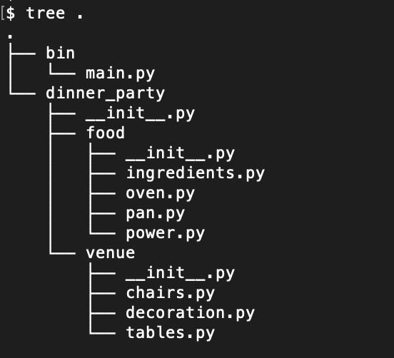
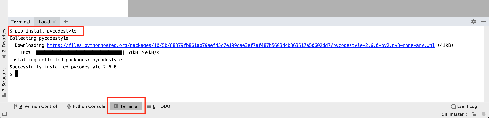
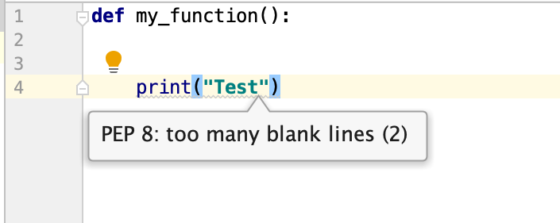
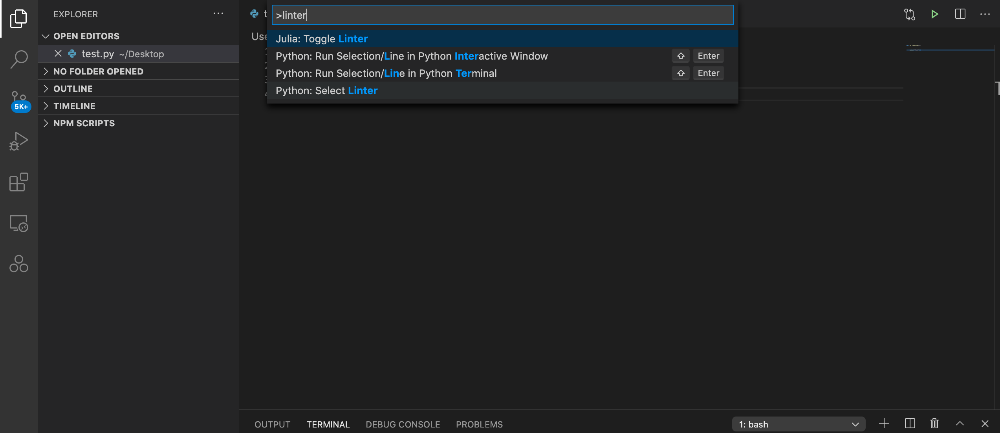
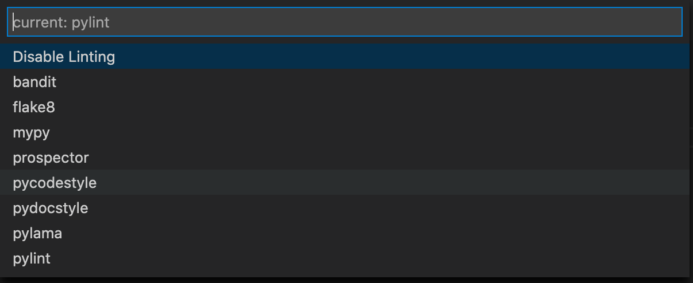
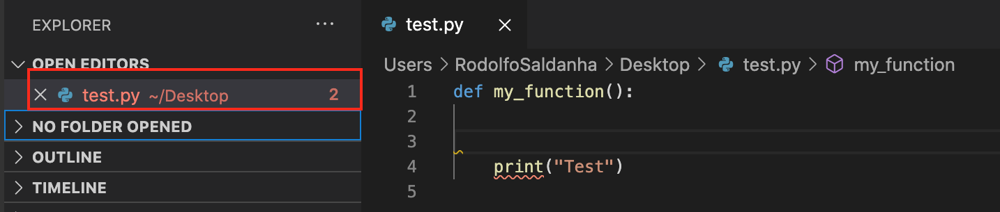

# Python Develop Environment

## Intro and Motivation

Many data scientists believe that Jupyter notebooks are a good way to develop code. While they are good for some things (communication in particular), they are NOT to be used as a development environment. The reason for this is that, as Data Scientists and Data Engineers, we are full-time Software Engineers as well. Since code is our medium, we must respect it and do our best to write it in a systematic way that is optimized for humans to interpret it and maintain it. Jupyter notebooks are the exact opposite of an environment in which code is easy to write and maintain and this is the motivation for this tutorial.

When engineering software (either for DS or DE), we will use a proper code editor and carefully organize the conceptual space we are dealing with into packages and modules while following a few conventions that will make it easier for other people (including future you) to further and maintain.

## Tools

You should use the [Python version 3.9.0](https://www.python.org/downloads/release/python-390/), which is the latest stabilized version, but if you have a reason to use earlier versions, feel free to do so.

The IDE that we use to code is either [Pycharm](https://www.jetbrains.com/pycharm/download/#section=mac) or [VS Code](https://code.visualstudio.com), and both of them are open source. However, the remote interpreter is available on the free version of VS Code but **not** the free version of PyCharm. So consider this before choosing one!

To install your preferred IDE is pretty straight-forward, and you just have to follow the steps presented by the installation guide.

## Modules

We can think of a module as a "sub-program". Each module should be responsible for one function of the software. And modules can depend on each other to execute a bigger task. A python module is nothing more than a file with a `.py` extension (_aka_ python file).

Think of modules as equipment/parts to cook a dinner. It is necessary a few components:

- Power, gas/electricity to generate the heat;
- Oven, to actually cook;
- Pan, to cook the food in it;
- Ingredients, part of the recipe;

All these parts fulfill functions, but it is their combination that enables us to achieve a final goal: cook the dinner. Modules work similarly in a software!

To use the code inside each module in other pieces of software, our code inside the module should be organized in attributes. Attributes of a module are classes, functions, and variables. These attributes of modules can be imported and used in other pieces of software.

We can classify modules into 3 types:

**1. Modules that belong to our current project**

Modules that are stored in the same directory as you are working on. Because of that, they are only available for the project you are working on. Normally these kinds of modules are the ones developed by us and that belong to the scope of the project.

- **Location**\
The current directory of the project where we want to use the module.

- **How to use**\
To use modules' attributes in our code, like notebooks or other python modules, you just need to import those attributes in the file where we are working on.
`import my_module.py`

**2. Modules stored on PYTHONPATH**

Modules that are stored in one of the directories assigned to the environment variable PYTHONPATH. Here we have the path to python environments. In python environments, modules are managed by pip. These modules are available in the environment in which they were installed. When you are using virtual environments, which you should always be, these will actually be in the virtual environment directory, which will be different for each one! Though if you switch projects but keep working in the same environment, these modules are still available. These modules are usually external dependencies and can be used in different types of projects.

- **Location**\
The directories assigned to the environment variable PYTHONPATH.

- **How to use**\
This type includes the ones that we manage with pip using the command line. Every time we do `pip install -r requirements.txt`, we are installing in our environment the packages (and respective modules) that are specified in the requirements file. We can also install a package (packages in python are folders with modules) using its name, with `pip install <package name>`. Another option is to execute `export PYTHONPATH=$PYTHONPATH:.`

**3. Modules that come with python**

Built-in modules are common to all python environments that share the same version. We do not need to do anything to have them available.

- **Location**\
The default directory of python, normally `/usr/local/lib/python`.

- **How to use**\
The last type of modules are the ones that already come with the current python version. We do not need to have them in our current directory or store them in our python environment. They are stored inside the directory of our python version.

## Packages

A package is a set of modules dedicated to a single function that can be installed and used in other software. Packages in python are namespaces (directories) that contain modules, but we can also have a package of packages.

Going back to the dinner analogy, let's say you are throwing a dinner party:

**Food**
- Power;
- Oven;
- Pan;
- Ingredients.

**Venue**
- Decoration;
- Tables;
- Chairs.

**Dinner party**
- Food;
- Venue.

Think of the set of tasks that we need to do to throw a dinner party as a piece of software that we are developing. In that sense, the dinner party is the package that we need to install in our environment, consequently food and venue, to use the set of modules. These modules are ready to use, the code that we need to develop in our software is what is needed to integrate all these components.

What distinguishes a python package from an ordinary folder is an `__init__.py` file inside of the corresponding directory of the package. It can be empty, but this file tells python that we are looking at a package. We can import it the same way we import a module. Some other files are normally added to packages, like setup.py, README.md, and LICENSE, but these are not mandatory.

To install packages that are indexed on PyPI, we can use the following Unix command:
`pip install <package namespace>`

## Code Structure

Keep in mind some guidelines when coding:

- Organize your code in modules (any `.py` file) and packages (a directory that has `__init__.py`).
    - Do top-level organization into other packages with good names that have an `__init__.py`.
- Have python files in a `bin` folder, and it should at the top level.
    - The `bin` is always imported from the other top-level packages.
- There should always be a command-line interface to your project.

Once again with the dinner party analogy previously made, this is how your project should be organized following these guidelines:

- Remember to always have the current directory on your PYTHONPATH environment variable (it is necessary for this to work).
- 80 character line limit (technically part of linting, but it is worth emphasizing).
- Use the GOTO definition.
    - You should NOT be clicking on files and scrolling around - it is a waste of time. You should do a single click to go there!
    - If you see a function and need to go to its definition, just press **Command** and click on the function name. You will be redirected to its definition instantly!

### Linting

As mentioned, it is important to keep the code organization. Linting is the automated checking of your source code for programmatic and stylistic errors. The package `pycodestyle`, which is a basic static code analyzer, is used to do this code check. This is a very handy package because when you write a new line of code that does not pass some VERY strict standards, you know it right away. Here it is how to add the package to the IDE:

##### Pycharm

After creating the environment of your project inside, you just have to go to **Terminal** at the bottom part of the IDE and install the package with pip with `pip install pycodestyle`.

In case the code has any problems, the package will have a similar suggestion as below.

##### VSCode

To add this package to VSCode, you can go to **Command + Shift + P** and find **Python: Select Linter**.

Then choose **pycodestyle**. The installation option will pop-up at the bottom.

In case the code has any problems, the IDE will mark them as errors.

## Exercises

A new client called "Beautiful Clothes,"  which is _shockingly_ a clothing store, hired us because they want us to find out the level of satisfaction of their public and understand how they can improve their services.

Before a client finishes a shopping order (either online or at the store), they must fill out a form requesting some personal data. This data is stored in a SQL database along with the amount spent. However, an employee is still learning how to use the software to register the orders, and sometimes some data is incorrectly stored.

Therefore, you will have to fetch the data from the database, preprocess it (this involves removing null data entries and detect weird values), and generate a pdf report about the store's clients. You do **not** need to actually implement the functions though. What we will evaluate here are the concepts covered in this tutorial and your project organizational skills.

Based on the problem presented above, do the following:
1. Choose an editor and install it on your machine.
2. Create a repository.
3. Create the files for the pipeline and organize them properly into directories.
